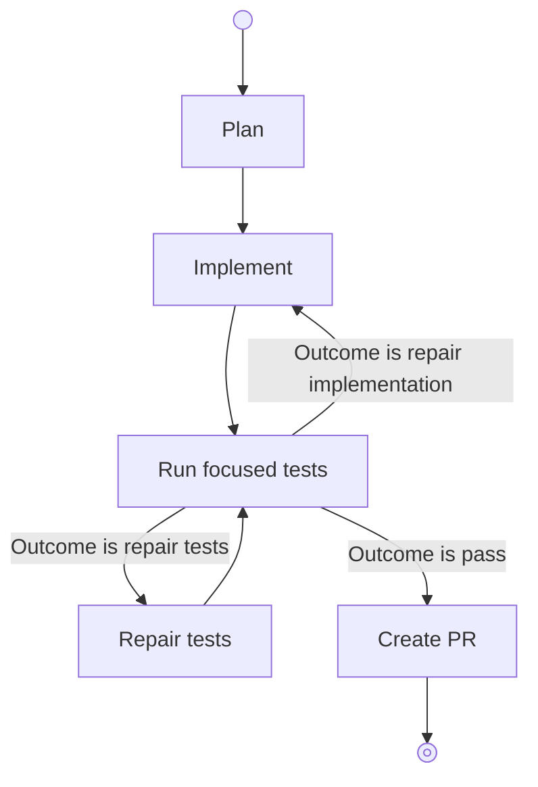

```mermaid
flowchart TD
_start@{ shape: sm-circ, label: "Start" }
plan["Plan"]
click plan href "steps/plan.md"
implement["Implement"]
click implement href "steps/implement.md"
tests["Run focused tests"]
click tests href "steps/tests.md"
repair_tests["Repair tests"]
click repair_tests href "steps/repair-tests.md"
pr["Create PR"]
click pr href "steps/pr.md"
_stop@{ shape: framed-circle, label: "Stop" }
click _start href "steps/_start.md"
click _stop href "steps/_stop.md"
_start --> plan
plan --> implement
implement --> tests
tests -->|Outcome is pass| pr
tests -->|Outcome is repair implementation| implement
tests -->|Outcome is repair tests| repair_tests
repair_tests --> tests
pr --> _stop
```
