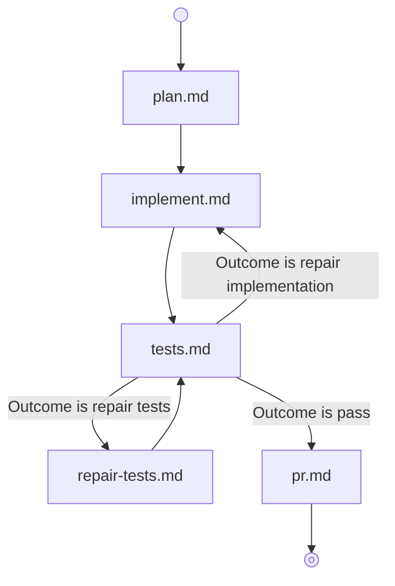

```mermaid
flowchart TD
_start@{ shape: sm-circ, label: "Start" }
plan["plan.md"]
implement["implement.md"]
tests["tests.md"]
repair_tests["repair-tests.md"]
pr["pr.md"]
_stop@{ shape: framed-circle, label: "Stop" }
_start --> plan
plan --> implement
implement --> tests
tests -->|Outcome is pass| pr
tests -->|Outcome is repair implementation| implement
tests -->|Outcome is repair tests| repair_tests
repair_tests --> tests
pr --> _stop
```
