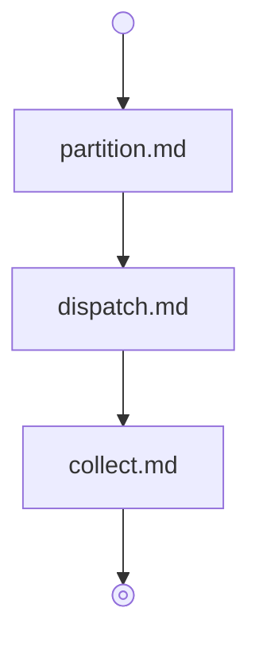

---
metadata:
  workflow: mermaid-v1
---

```mermaid
flowchart TD
_start@{ shape: sm-circ, label: "Start" }
partition["partition.md"]
dispatch["dispatch.md"]
collect["collect.md"]
_stop@{ shape: framed-circle, label: "Stop" }
_start --> partition
partition --> dispatch
dispatch --> collect
collect --> _stop
```
