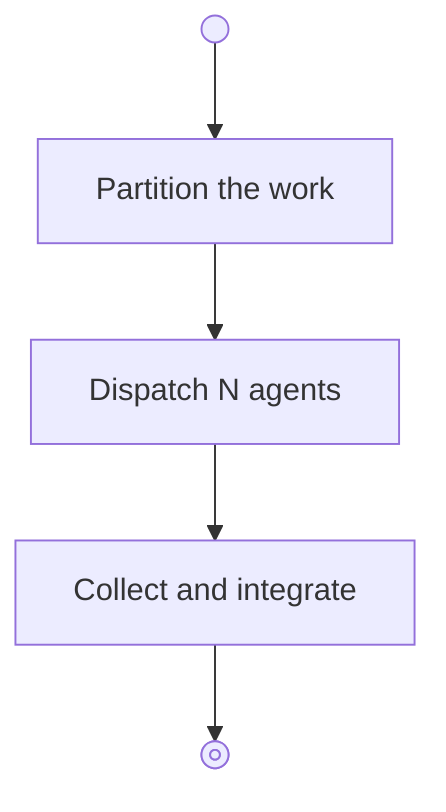

---
metadata:
  workflow: mermaid-v1
---

```mermaid
flowchart TD
_start@{ shape: sm-circ, label: "Start" }
partition["Partition the work"]
click partition href "implement/partition.md"
dispatch["Dispatch N agents"]
click dispatch href "implement/dispatch.md"
collect["Collect and integrate"]
click collect href "implement/collect.md"
_stop@{ shape: framed-circle, label: "Stop" }
click _start href "implement/_start.md"
click _stop href "implement/_stop.md"
_start --> partition
partition --> dispatch
dispatch --> collect
collect --> _stop
```
