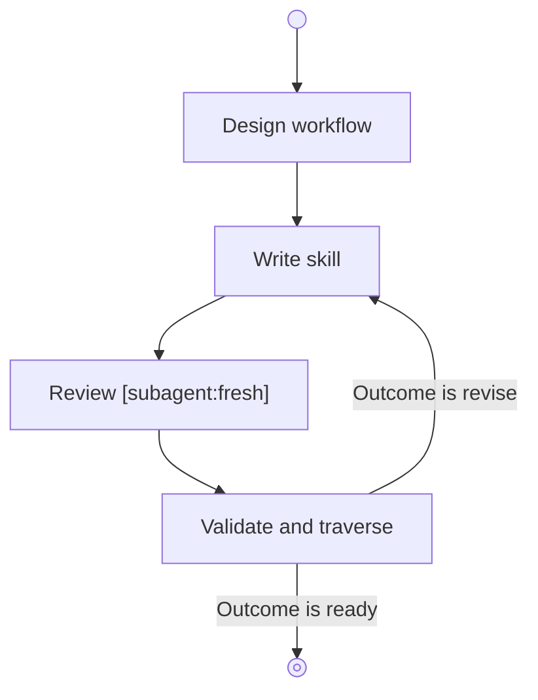

```mermaid
flowchart TD
_start@{ shape: sm-circ, label: "Start" }
design["Design workflow"]
write["Write skill"]
review["Review [subagent:fresh]"]
check["Validate and traverse"]
_stop@{ shape: framed-circle, label: "Stop" }
click _start href "steps/_start.md"
click design href "steps/design.md"
click write href "steps/write.md"
click review href "steps/review.md"
click check href "steps/check.md"
click _stop href "steps/_stop.md"
_start --> design
design --> write
write --> review
review --> check
check -->|Outcome is revise| write
check -->|Outcome is ready| _stop
```
