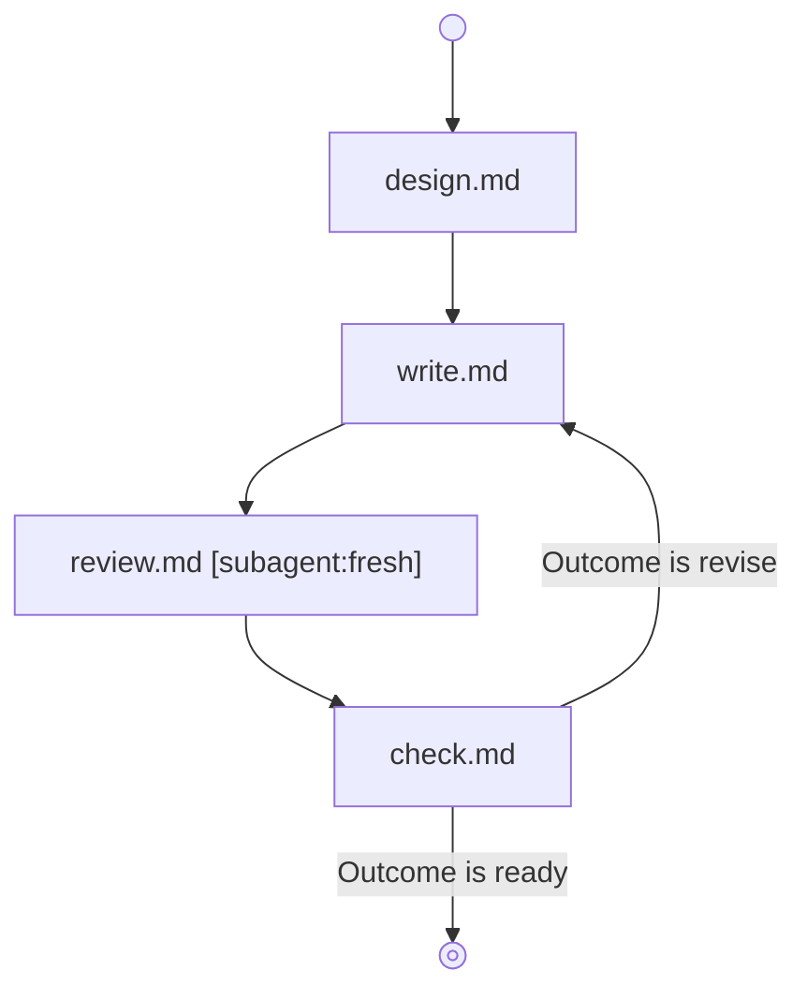

```mermaid
flowchart TD
_start@{ shape: sm-circ, label: "Start" }
design["design.md"]
write["write.md"]
review["review.md [subagent:fresh]"]
check["check.md"]
_stop@{ shape: framed-circle, label: "Stop" }
_start --> design
design --> write
write --> review
review --> check
check -->|Outcome is revise| write
check -->|Outcome is ready| _stop
```
